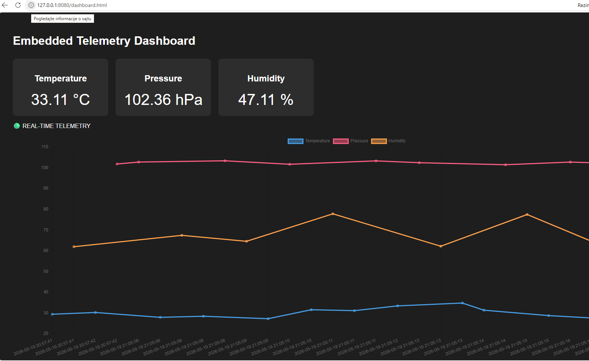
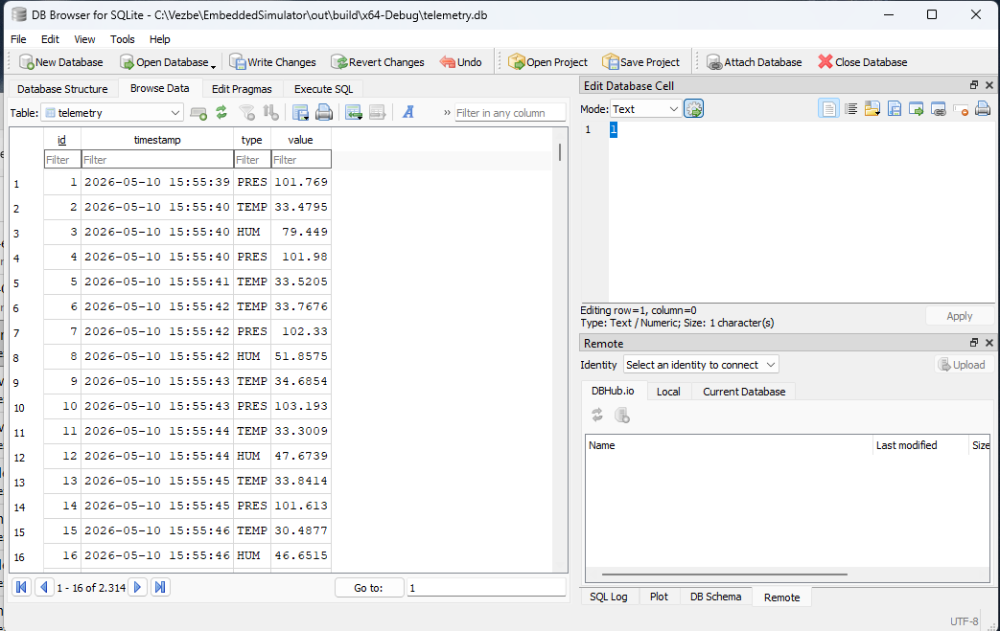

# Embedded Sensor Simulator
Current Release: v5.0
# Architecture

## Overview

EmbeddedSensorSimulator is a C++ telemetry platform that simulates embedded sensor devices and exposes data through multiple channels:

- TCP binary telemetry stream
- WebSocket live telemetry
- REST API
- SQLite historical storage
- Web dashboard
- CSV logging
- Alarm monitoring

## High-Level Flow

```text
Sensor Threads
   |
   v
Binary Protocol Encoder
   |
   v
TCP Telemetry Server
   |
   +--> TCP Client Parser
   |       |
   |       +--> CSV Logger
   |       +--> Alarm System
   |       +--> SQLite Database
   |
   +--> WebSocket Live Stream
           |
           v
        Web Dashboard


SQLite Database
   |
   v
REST API
   |
   +--> /latest
   +--> /history
   |
   v
Web Dashboard Charts
```
# Main Components
## Sensor Simulator

## Generates simulated telemetry values:

Temperature
Pressure
Humidity

Each sensor runs periodically and produces real-time values.

## Binary Protocol

Sensor data is encoded into compact binary packets.

## Responsibilities:

packet creation
packet type identification
payload encoding
stream-safe parsing
TCP Server

Streams binary telemetry packets to connected clients.

## Features:

multi-client support
real-time broadcasting
client disconnect handling
TCP Client Parser

Receives binary packets from the TCP server and decodes them into structured telemetry data.

## Responsibilities:

receive TCP stream
reconstruct packets
parse sensor type and value
forward data to logger, alarm system and storage
SQLite Storage

Stores historical telemetry records.

Used by:

REST /history
dashboard history chart
REST API

Provides HTTP access to telemetry data.

Endpoints:
```text
GET /status
GET /latest
GET /history
```
## WebSocket Stream
Provides real-time telemetry updates to the web dashboard without polling.
## Web Dashboard
Displays:
```text
latest sensor values
live status
history chart
alarm indicators
```
## REST API
HTTP API for latest sensor values.
**Endpoints**
**Status**
GET /status
**Response:**
REST server running

**Latest Sensor Values**
GET /latest

**Example response:**
```text
{
  "temperature": 24.8,
  "pressure": 1013.2,
  "humidity": 45.1
}
```
---
## Project Structure
```text
EmbeddedSensorSimulator/
│
├── include/
│   ├── protocol/
│   ├── network/
│   ├── client/
│   └── rest/
│
├── src/
│   ├── protocol/
│   ├── network/
│   ├── sensor/
│   ├── client/
│   └── rest/
│
├── third_party/
│
├── config.json
├── CMakeLists.txt
├── README.md
└── .gitignore
```
## Technologies
- C++17
- WinSock2
- CMake
- Multi-threading
- TCP/IP
- REST API
- JSON
- Python
- matplotlib
## Build

**Requirements**
- Visual Studio 2022
- CMake
- Python 3.x

**Build Steps**
```text
git clone <repo_url>
cd EmbeddedSensorSimulator
```
Open project in Visual Studio and build using CMake.

## Running
**Start Server**

Run:
```text
   - ServerApp.exe
   - Start Client
```
## Start Client

**Run one or more:**
ClientApp.exe
## Bash
- http://localhost:8080/dashboard.html

## REST API
Open browser:

- http://localhost:8080/status
- http://localhost:8080/latest
- http://localhost:8080/history

## Example Console Output
- TEMP: 24.81
- PRES: 1013.2
- HUM: 45.3

## Future Improvements
- [x] Web dashboard
- [x] SQLite telemetry storage
- [x] WebSocket streaming
- [ ] Unreal Engine visualization
- [ ] Authentication
- [ ] Docker deployment 

## Unreal Engine integration plan
The simulator exposes REST endpoints for real-time telemetry:

- `/latest` - latest TEMP/PRES/HUM values
- `/history` - historical telemetry records

Planned Unreal integration:
- HTTP GET every 1 second
- parse JSON
- display values in 3D dashboard
- later WebSocket/TCP live streaming

## Dashboard
‎

## SQlite telemetry
‎

## Cross-platform support

Successfuly tested on:
 - Windows
 - Ubuntu 22.04 Linux

 ### Linux build

 ```bash
 mkdir build
 cd build
 cmake ..
 make
 ./ServerApp
 ```


## Author  

Srbislav Petrovic

## License

MIT License

